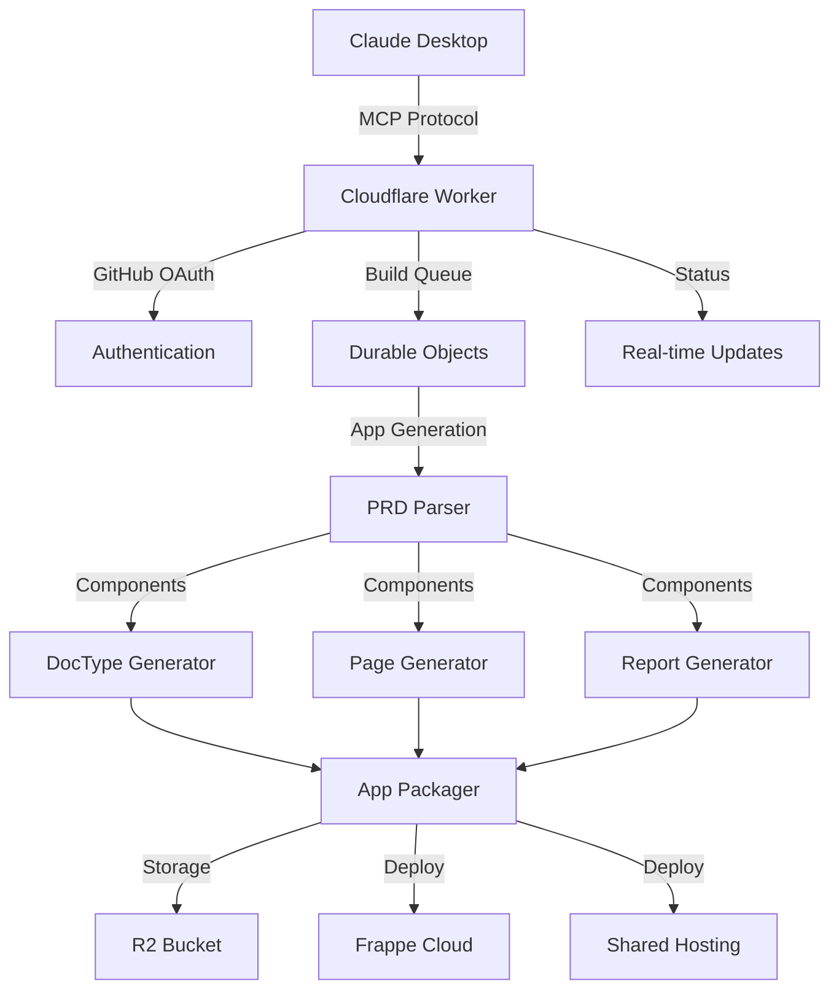

# Cloudflare Frappe App Builder

A complete **cloud-based solution** for building, storing, and deploying Frappe/ERPNext apps entirely on Cloudflare infrastructure.

## 🌟 Features

### 🏗️ **Complete Cloud App Building**
- **PRD-to-App Generation**: Convert Product Requirement Documents into full Frappe apps
- **Zero Local Dependencies**: Everything runs in Cloudflare Workers
- **Multi-User Support**: Multiple developers can build apps simultaneously
- **Real-time Build Status**: Live updates via WebSocket connections

### 🔧 **Generated App Components**
- **DocTypes**: Automatic generation with fields, permissions, and validations
- **Pages**: Custom web pages with routes and templates
- **Reports**: Query reports and analytics
- **Web Forms**: Public-facing forms
- **Workflows**: Business process automation

### ☁️ **Cloud Infrastructure**
- **Cloudflare Workers**: Serverless app generation and API
- **R2 Storage**: Unlimited app package storage
- **KV Storage**: Metadata and build status
- **Queues**: Asynchronous build processing
- **Durable Objects**: Stateful build management

### 🚀 **Deployment Options**
- **Frappe Cloud**: Direct deployment to shared hosting
- **Custom Sites**: Deploy to specific Frappe instances
- **App Marketplace**: Publish to Frappe app marketplace
- **Download Packages**: Get installable app files

## 🛠️ Available Tools (MCP)

### 🔨 **build_app**
Build a complete Frappe app from PRD content
```
Input: PRD content, app configuration, deployment settings
Output: Build ID, status, estimated completion time
```

### 📋 **list_apps**
List all built apps with filtering and pagination
```
Input: User filter, status filter, pagination
Output: Apps list with build status and metadata
```

### 🚀 **deploy_app**
Deploy a built app to a specific Frappe site
```
Input: App ID, target site, environment
Output: Deployment status and details
```

### 🌐 **manage_site**
Create, delete, backup, or restore Frappe Cloud sites
```
Input: Action, site name, configuration
Output: Operation status and site details
```

### 📊 **get_build_status**
Get real-time build progress and logs
```
Input: Build ID
Output: Status, progress percentage, logs
```

### 💾 **download_app**
Get secure download link for app packages
```
Input: App ID
Output: Signed download URL with expiration
```

## 🚀 Quick Start

### 1. Setup
```bash
cd /Users/mekdesyared/erpnext-app-builder/cloudflare-app-builder
./setup.sh
```

### 2. Configure Environment
Edit `.dev.vars` with your credentials:
```bash
# GitHub OAuth
GITHUB_CLIENT_ID=your_github_oauth_client_id
GITHUB_CLIENT_SECRET=your_github_oauth_secret

# Frappe Cloud
FRAPPE_CLOUD_API_KEY=your_frappe_cloud_api_key
FRAPPE_CLOUD_API_SECRET=your_frappe_cloud_api_secret

# Authorization
ALLOWED_BUILDERS=mekdesyared,teammate1,teammate2
```

### 3. Create Cloudflare Resources
```bash
# Login to Cloudflare
wrangler login

# Create KV namespaces
wrangler kv namespace create "OAUTH_KV"
wrangler kv namespace create "APP_STORAGE"

# Create R2 bucket
wrangler r2 bucket create frappe-apps-storage

# Update wrangler.jsonc with returned IDs
```

### 4. Test Locally
```bash
npm run dev
# Server available at http://localhost:8787
```

### 5. Deploy to Production
```bash
npm run deploy
```

## 🏗️ Architecture



## 🔧 Component Architecture

### **Build Process Flow**
1. **PRD Analysis**: Parse requirements and extract components
2. **Structure Generation**: Create Frappe app file structure
3. **Component Generation**: Generate DocTypes, Pages, Reports
4. **Package Creation**: Bundle all files into deployable package
5. **Cloud Storage**: Store in R2 with metadata in KV
6. **Deployment**: Deploy to Frappe Cloud or shared hosting
7. **Notification**: Real-time status updates via WebSocket

### **Multi-User Support**
- **User Isolation**: Each user's apps are isolated by GitHub username
- **Concurrent Builds**: Multiple builds can run simultaneously
- **Build Queue**: Automatic queuing and processing of build jobs
- **Resource Limits**: Configurable limits per user and globally

### **Security Model**
- **GitHub OAuth**: Secure authentication and authorization
- **User-based Access**: Users can only access their own apps
- **Builder Permissions**: Only authorized users can build apps
- **Signed URLs**: Secure download links with expiration

## 📱 Usage Examples

### Building Your First App

1. **Connect via Claude Desktop**:
```json
{
  "mcpServers": {
    "cloudflare-app-builder": {
      "command": "npx",
      "args": [
        "mcp-remote",
        "https://your-worker.workers.dev/mcp"
      ]
    }
  }
}
```

2. **Build an App**:
```
"Build a CRM app with the following requirements:

# Customer Management
- Customer DocType with fields: Name (Data, Required), Email (Data), Phone (Data), Company (Link to Company)

# Lead Tracking  
- Lead DocType with fields: Lead Name (Data, Required), Status (Select: New, Qualified, Converted), Source (Select)

# Reports
- Customer Report showing all customers with contact details
- Lead Conversion Report by source

Please create this as a complete Frappe app called 'simple_crm'"
```

3. **Monitor Progress**:
```
"Check the build status for my CRM app"
```

4. **Deploy**:
```
"Deploy my simple_crm app to my development site 'mycompany-dev'"
```

## 🔧 Configuration Options

### **App Configuration**
```typescript
{
  name: "my_app",           // Unique app name
  title: "My App",          // Display title
  description: "App desc",   // Description
  version: "1.0.0",         // Semantic version
  publisher: "My Company",   // Publisher name
  email: "admin@company.com", // Contact email
  license: "MIT"            // License type
}
```

### **Deployment Configuration**
```typescript
{
  createSite: false,                    // Create new site
  siteName: "my-site",                  // Site name
  uploadToSharedHosting: true,          // Upload to shared hosting
  makePublic: false,                    // Make publicly available
  targetEnvironment: "development"      // Target environment
}
```

## 🚀 Production Deployment

### **Environment Variables** (Production)
```bash
wrangler secret put GITHUB_CLIENT_ID
wrangler secret put GITHUB_CLIENT_SECRET
wrangler secret put COOKIE_ENCRYPTION_KEY
wrangler secret put FRAPPE_CLOUD_API_KEY
wrangler secret put FRAPPE_CLOUD_API_SECRET
wrangler secret put ALLOWED_BUILDERS
```

### **GitHub OAuth App** (Production)
- Homepage URL: `https://your-worker.your-subdomain.workers.dev`
- Callback URL: `https://your-worker.your-subdomain.workers.dev/callback`

### **Resource Scaling**
- **Build Concurrency**: Adjustable via `MAX_CONCURRENT_BUILDS`
- **Storage Limits**: R2 provides unlimited storage
- **Queue Processing**: Automatic scaling with Cloudflare Queues
- **Geographic Distribution**: Global deployment via Cloudflare edge

## 🔍 Monitoring & Debugging

### **Build Logs**
- Real-time build progress tracking
- Detailed error messages and stack traces
- Historical build data retention

### **Metrics**
- Build success/failure rates
- Average build times
- User activity tracking
- Resource utilization

### **Troubleshooting**
- Build queue status monitoring
- Failed build retry mechanisms
- Detailed error reporting with context

## 🆚 Comparison with Local Setup

| Feature | Local MCP Server | Cloud App Builder |
|---------|------------------|-------------------|
| **Infrastructure** | Local only | Global Cloudflare |
| **Scalability** | Single user | Multi-user |
| **Availability** | Machine dependent | 24/7 uptime |
| **Storage** | Local disk | Unlimited R2 |
| **Collaboration** | Manual sharing | Built-in sharing |
| **Deployment** | Manual process | Automated |
| **Maintenance** | User managed | Fully managed |

## 🎯 Use Cases

### **Individual Developers**
- Rapid prototyping of Frappe apps
- Learning Frappe development
- Building personal projects

### **Development Teams**
- Collaborative app development
- Standardized development workflow
- Automated testing and deployment

### **Agencies & Consultants**
- Client app development
- Quick POC creation
- Multi-client project management

### **Training & Education**
- Frappe development courses
- Hands-on workshops
- Student project management

This complete cloud solution provides enterprise-grade app building capabilities while maintaining the simplicity of the MCP protocol for interaction through Claude Desktop.
